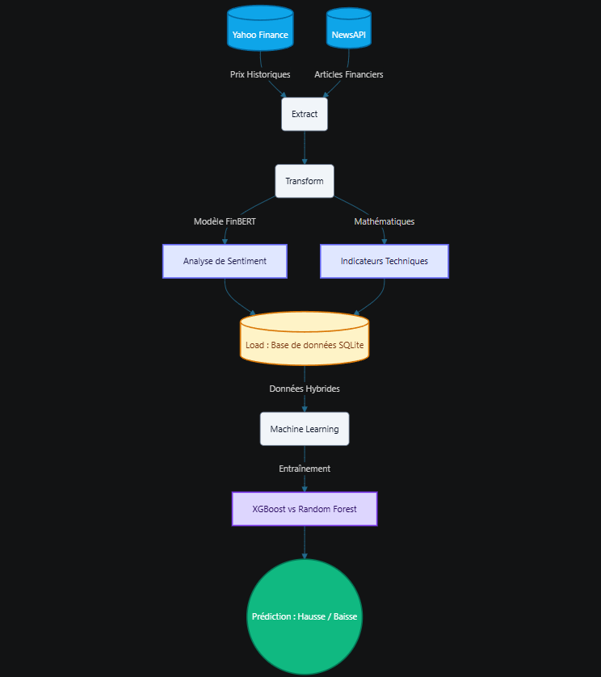

# 📈 Analyseur de Signaux Mixtes (Finance & NLP)


## 🎯 Contexte du Projet
Ce projet déploie un pipeline de Machine Learning de bout-en-bout conçu pour prédire la tendance boursière à court terme. Son innovation repose sur l'hybridation des données, on va avoir une combinaison d'analyse technique classique des prix (données quantitatives) avec de l'analyse du sentiment de l'actualité financière via l'Intelligence Artificielle (données textuelles traitées par FinBERT).

## 🏗️ Architecture du Pipeline

*(Aperçu de la structure des données et du flux ETL)*


## 📂 Structure du Projet

Le code est architecturé selon les standards de l'ingénierie des données, séparant clairement les étapes d'Extraction, Transformation et Chargement (ETL). 

Voici comment naviguer dans le projet :

```text
Projet_Finance_NLP/ 
├── Data/                         # Stockage des artefacts générés, comme le modèle final (champion_model.pkl)
│
├── Images/                       # Sauvegarde des graphiques analytiques (ROC, Matrices, Sentiment, etc.)
│
├── Notebooks/              
│   ├── Data/                     # Données synthétiques historiques pour l'exploration
│   │
│   ├── 01_exploration...         # Carnet de recherche et de tests initiaux où les fonctions vont être crées
│   │
│   └── 02_Rapport_de_Synthèse    # Le rapport final contenant toutes les analyses et visualisations que je vous conseille de regarder
│
│
├── SQL/                          # Stockage de la base de données relationnelle SQLite (finance_nlp.db)
│
├── Src/                    # Source
│   ├── extract.py          # Fonctions d'extraction via les API (yfinance & NewsAPI)
│   │
│   ├── transform.py        # Feature Engineering (calcul du RSI, SMA) et NLP (FinBERT)
│   │
│   ├── load.py             # Création du schéma en étoile et insertion SQL
│   │
│   └── train.py            # Modélisation ML (XGBoost et Random Forest)
│
├── pipeline_run.py         # Le fichier d'exécution
│
└── requirements.txt        # Liste des dépendances Python du projet
```

Pourquoi cette architecture ?

Modularité (Src/) : Chaque étape du traitement de la donnée est isolée dans un script dédié, ce qui rend le code propre, maintenable et testable.

Séparation Stockage/Code (SQL/ & Data/) : Les bases de données et les modèles lourds sont isolés des scripts d'exécution pour respecter les bonnes pratiques de déploiement[cite: 2].

Automatisation (pipeline_run.py) : Ce script importe les fonctions de Src/ pour lancer l'ensemble du processus de manière automatisée.

## ⚙️ Installation et Exécution
Installation des dépendances :
Assurez-vous d'avoir Python installé, puis exécutez la commande suivante à la racine du projet :

Bash
pip install -r requirements.txt
Configuration de l'API (Optionnel) :
Le projet utilise l'API NewsAPI pour télécharger les articles de presse. Pour lancer l'extraction vous-même, créez un fichier nommé .env à la racine et ajoutez-y votre clé :

Plaintext
NEWS_API_KEY=votre_cle_api_ici
Lancer la chaîne complète :
Une seule commande suffit pour déclencher l'ETL, l'analyse NLP, l'insertion SQL et l'entraînement du modèle :

Bash
python pipeline_run.py

## 📊 Résultats et Analyse Détaillée
Le sentiment des actualités permet-il réellement d'améliorer les prédictions boursières par rapport à un modèle uniquement basé sur les prix ?

👉 Pour découvrir la réponse, les performances du modèle XGBoost, et toutes les visualisations interactives, rendez-vous dans le rapport de synthèse :
📂 Voir le Notebook : 02_Rapport_de_Synthese.ipynb
